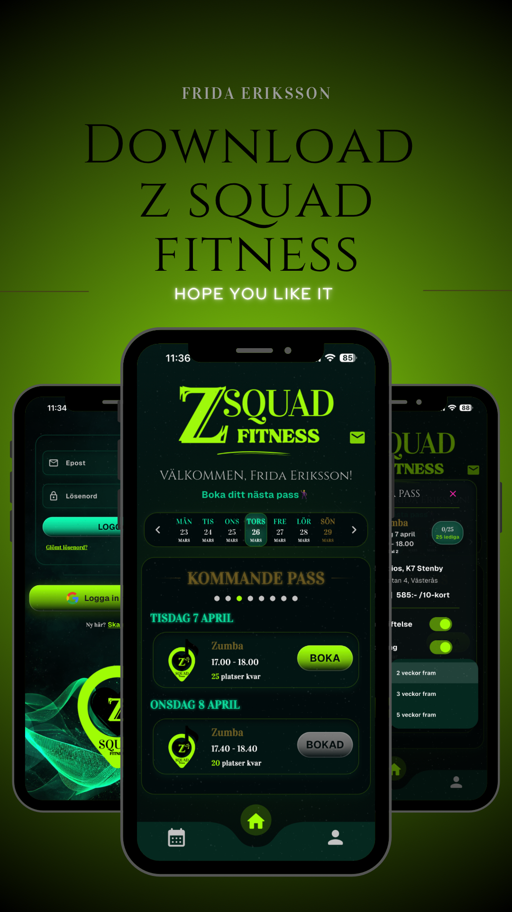

<div align="center">


En Flutter-app för att boka Zumba- och träningspass. 

Byggd med ❤️ för Z Squad fitness i Västerås.


</div>

## 📋 Projektplanering
Projektets uppgifter, roadmap och planering finns på Trello:

**[→ Öppna ZSquad Fitness på Trello](https://trello.com/b/tYig1N1V/zsquadfitness)**

---
## ✨ Funktioner

- Boka och avboka Zumba- och andra träningspass
- Veckokalender med tydlig överblick över kommande pass
- Personlig profil med namn, telefon, e-post + bokningsstatistik
- Inloggning med e-post/lösenord eller Google
- Realtidsuppdateringar via **Firebase Firestore**
- Mörkt neon-tema (grönt/pink/turkos)
- Admin vy för att skapa, redigera och hantera pass

---

## 🛠 Teknikstack

- **Flutter** (Dart)
- **Firebase**  
  - Authentication (Email + Google Sign-In)
  - Firestore (pass, bokningar, användardata)
  - Cloud Functions (ex. epostbekräftelser)
- **intl** för svensk datumformatering
- **PageView** + **GestureDetector** för smidig kalender

---

## 🚀 Kom igång

### Förutsättningar

- [Flutter SDK](https://flutter.dev) (3.24+ rekommenderas 2025/2026)
- Dart SDK 
- Android Studio / Xcode / VS Code
- Firebase-projekt (med Authentication och Firestore aktiverat)

### Steg-för-steg

1. Klona repot

   ```bash
   git clone https://github.com/din-användare/zsquad-fitness.git
   cd zsquad-fitness
   flutter pub get
   dart pub global activate flutterfire_cli
   flutterfire configure --project=(projekt namn)
   flutter run

### 🔧 Konfigurera Firebase
- Gå till Firebase Console
- Skapa nytt projekt (eller använd befintligt)
- Lägg till Android- och/eller iOS-app
- Ladda ner google-services.json (Android) → placera i android/app/
- Ladda ner GoogleService-Info.plist (iOS) → placera i ios/Runner/
- Aktivera Email/Password och Google i Authentication
- Skapa Firestore-databas (testläge under utveckling)

## 📌 Status
Detta är ett aktivt examensarbete/projekt under vidareutveckling.
### Framtidsplaner  
  - Gemensam chatt för alla deltagare för pepp, tips och önskemål
  - Köpa 10 kort som klipper direkt i appen efter utfört pass - digital kvitto
  - Köpa engångspass direkt i appen
  - Synka sina bokningar till sin kalender i telefonen
  - Se spotifylistor
  - Se youtube videos från min kanal

<h2 align="center">ZSquad Fitness – Boka pass, svettas loss, ha kul! 💃🔥🕺</h2>
